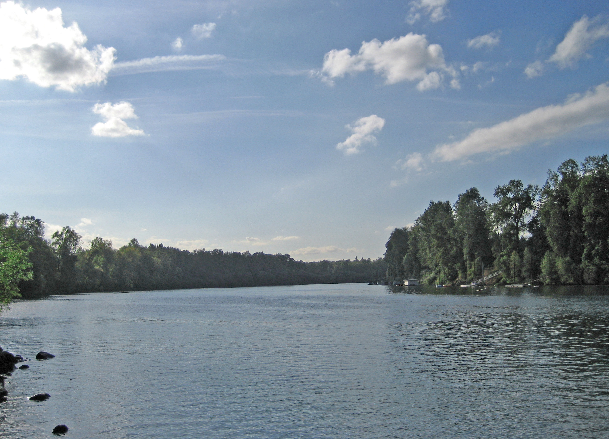
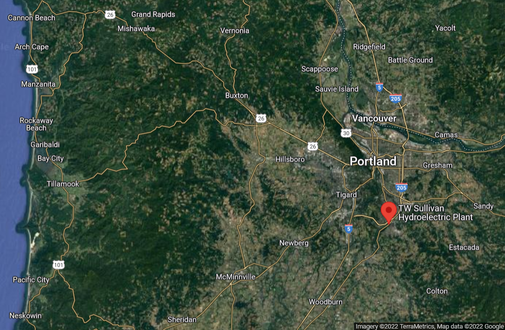

```{r setup, include=FALSE}
knitr::opts_chunk$set(echo = TRUE)
library(ggplot2)
library(tidyverse)
library(patchwork)
library(lubridate)
library(tsibble)
library(reshape) #this uses "rename," as does dplyr
library(feasts)
library(prettydoc)
```


<h1 align="center">Introduction</h1>
<br></br>

Image source: M.O. Stevens & Fcb981 (ed.). 2007. Accessed 03/13/2022 via <a href = https://en.wikipedia.org/wiki/File:Willamette_River_at_Molalla_SP_eb.jpg>Wikipedia</a>. The image is in the public domain.


The Willamette River is located in western Oregon and flows through the city of Portland. Fish counts have been collected at the Sullivan project dam, located at Willamette Falls, for fish making use of ladder to bypass the dam. We will be looking at three species of interest: Coho, Jack Coho, and Steelhead.

Data (c) 2001-2022, Oregon Department of Fish & Wildlife. Willamette Falls (Sullivan Project) Adult Passage Visual Counts. Accessed 03/13/2022 via <a href = https://drive.google.com/file/d/1WLRL0Jp0gjNHJlIHWGSJer4LpwbsP30W/view?usp=sharing>Google Drive</a>.

Additional data can be downloaded via <a href = http://www.cbr.washington.edu/dart/query/adult_graph_text>Columbia River DART</a>; the organization providing the data varies depending on the selected location.

The dam and fish ladder are located near West Lynn, Oregon, south of Portland.



Image (c) 2022 Google and TerraMetrics, accessed 03/13/2022 at <a href = https://www.google.com/maps/place/T.+W.+Sullivan+Hydroelectric+Plant/@45.3626439,-122.8169179,51412m/data=!3m1!1e3!4m5!3m4!1s0x5495712b47479f29:0x67416d9cba69a49d!8m2!3d45.3538392!4d-122.6191158> Google Maps</a>.


```{r load data,message=FALSE}
fishes = read.csv("willamette_fish_passage.csv") #load the data

#we are working with Coho, Jack.Coho, and Steelhead, so let's get rid of everything else
#we can remove the NAs (replacing with 0) at the same time

fishes2 = data.frame(replace_na(pull(fishes,Date),0),replace_na(pull(fishes,Coho),0), #it doesn't appear as though there are NAs in the date column, but for consistency's sake...
                     replace_na(pull(fishes,Jack.Coho),0),replace_na(pull(fishes,Steelhead),0))
colnames(fishes2)=c("Date","Coho","Jack Coho","Steelhead")

fishes2$Date = mdy(fishes2$Date)
fishes = as_tsibble(fishes2,key=NULL,index=Date)

```

## Data Visualization and Takeaways {.tabset}

### Over Time 

Here we present the time series data for each of the three species of interest.

```{r plot data}
#plot Coho, Jack.Coho, and Steelhead

#get the species as a column value
fishes_plotting = melt(as.data.frame(fishes),id=1)
colnames(fishes_plotting)=c("Date","Species","Count")


fishplot1 = ggplot(fishes_plotting,aes(x=Date,y=Count,group=Species))+geom_point(aes(color=Species,shape=Species),size=1)+#need to make the 3 lines a bit bigger so they can be seen where they overlap
  theme_minimal()+scale_shape_manual(values=c(0,4,3))
  

fishplot1+plot_annotation(caption="Figure 1: Count over time for Coho, Jack Coho, and Steelhead, from 2001 to 2010.\nSpecies are differentiated using the same color and symbol as in other figures.\nHowever, the size of each point has been made smaller in this figure to reduce clutter.")
```


```{r plot data for each species individually}
fishplot2=ggplot(fishes,aes(x=Date,y=Coho))+geom_point(aes(color="#F8766D",shape=0))+theme_minimal()+
  theme(legend.position="none")+scale_shape_identity()+scale_color_identity()
fishplot3=ggplot(fishes,aes(x=Date,y=`Jack Coho`))+geom_point(aes(color="#00BA38",shape=4))+theme_minimal()+
  theme(legend.position="none")+scale_shape_identity()+scale_color_identity()
fishplot4=ggplot(fishes,aes(x=Date,y=Steelhead))+geom_point(aes(color="#619CFF",shape=3))+theme_minimal()+
  theme(legend.position="none")+scale_shape_identity()+scale_color_identity()

(fishplot2/fishplot3/fishplot4) + plot_annotation(caption="Figure 2: Separate graphs of count over time for each of Coho, Jack Coho, and Steelhead, from 2001 to 2010.\nSpecies are differentiated using the same color and symbol as in other figures.\nHowever, the size of each point has been made smaller in this figure to reduce clutter.")
```


Fish counts rise and fall in a cyclical pattern for all three species. The timing of peak fish counts is approximately the same for Coho and Jack Coho, and happens in the latter half of the year. Outside the relatively short peak observation time, Coho and Jack Coho are virtually absent from the fish ladder. Steelhead count pattern differs slightly; it peaks at approximately the middle of the year, and there is a much wider range around the peak where steelhead are still being observed, albeit at lower numbers.

### Seasonplots

By using a season plot we can more easily observe the variation in fish counts over the course of a year.

```{r seasonplot}
#create 3 plots, 1 for each species
coho_se=gg_season(fishes,y=Coho)+theme_minimal()+theme(legend.position="none")
jcoho_se = gg_season(fishes,y=`Jack Coho`)+theme_minimal()+theme(legend.position="none")
sth_se = gg_season(fishes,y=Steelhead)+theme_minimal()+theme(legend.position="bottom") #we only need 1 legend since the colors for each year are the same on all 3 plots

#plot them
coho_se/jcoho_se/sth_se+plot_annotation(caption="Figure 3: Season plots for the three species.\nY axis indicates the number of individuals observed, and the color of the lines on each plot indicates the year.")

```

The season plot bears out the conclusions from looking at the time series data across all years. Coho and Jack Coho peak in October (late in the year) and are more ore less absent outside the August-December range. Conversely, Steelhead are observed throughout the year, with the peak observation time being in May-June. The season plot makes it easier to see that, for Steelhead, August-December counts are much lower than the counts for January-July.

### Annual Totals

Here we consider the yearly total counts at the fish ladder for each species.

```{r annual total,warning=FALSE}
#get just the year in a column
fishes_yr = as_tibble(fishes) %>%
  mutate(Date=year(Date))%>%
  group_by(Date) %>%
  summarise(Coho = sum(Coho),`Jack Coho` = sum(`Jack Coho`),Steelhead = sum(Steelhead))
colnames(fishes_yr)=c("Year","Coho","Jack Coho","Steelhead")
fishes_yr$Year=as.character(fishes_yr$Year) #converting it to a character data type should force it to be treated as categorical by default

fy2 = melt(as.data.frame(fishes_yr),id=1)
colnames(fy2)=c("Year","Species","Count")

fyplot = ggplot(fy2,aes(x=Year,y=Count,group=Species))+geom_point(aes(color=Species,shape=Species),size=1.5,stroke=2)+
  theme_minimal()+scale_shape_manual(values=c(0,4,3))+labs(y="Total Annual Count")
fyplot+plot_annotation(caption="Figure 4: Total annual count by year, for each of the three species of interest.\nSpecies are differentiated using the same color and symbol as in other figures.")

```

Because Jack Coho counts are much lower than the other species, a separate graph makes it easier to see the pattern in annual counts for Jack Coho.

```{r annual total jack coho}
fyplot2 = ggplot(fishes_yr,aes(x=Year,y=`Jack Coho`))+geom_point(aes(color="#00BA38",shape=4,size=1.5,stroke=2))+
  theme_minimal()+labs(y="Jack Coho Count")+theme(legend.position="none")+scale_shape_identity()+scale_color_identity()+scale_size_identity()
fyplot2+plot_annotation(caption="Figure 5: Total annual count by year for Jack Coho.\nSpecies are differentiated using the same color and symbol as in other figures.")

```

From these figures, we observe: 

1. Steelhead annual counts are high (25000-50000) early in the 2000s, but decline to 20000-30000 from 2005 to 2009. The 2010 count for Steelhead is higher, at almost 35000; this may indicate that the population using the fish ladder is increasing again, but it is probably too soon to tell.

2. Coho annual counts for most of the 2000s are relatively low compared to Coho counts in 2009 and 2010; values jump from a range of about 2000-10000 to over 20000 in the last two years of the dataset.

3. Jack Coho annual counts range from as low as 100 to about 3000, and this range does not seem to show an obvious increasing trend over the dataset.

4. For all three species, annual counts seem to rise and fall in an approximately 2-4 year cycle.
